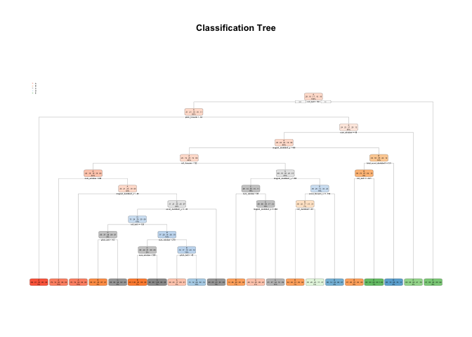

# Prediction Assignment Writeup
Rodrigo Chagas  
12/10/2017  


## Summary
Using devices such as Jawbone Up, Nike FuelBand, and Fitbit it is now possible to collect a large amount of data about personal activity relatively inexpensively. These type of devices are part of the quantified self movement - a group of enthusiasts who take measurements about themselves regularly to improve their health, to find patterns in their behavior, or because they are tech geeks. One thing that people regularly do is quantify how much of a particular activity they do, but they rarely quantify how well they do it. In this project, your goal will be to use data from accelerometers on the belt, forearm, arm, and dumbell of 6 participants. They were asked to perform barbell lifts correctly and incorrectly in 5 different ways. More information is available from the website here: http://groupware.les.inf.puc-rio.br/har (see the section on the Weight Lifting Exercise Dataset).      

##Data
The training data for this project are available here:  
https://d396qusza40orc.cloudfront.net/predmachlearn/pml-training.csv  
The test data are available here:  
https://d396qusza40orc.cloudfront.net/predmachlearn/pml-testing.csv  
  
*The data for this project come from this source: http://web.archive.org/web/20161224072740/http:/groupware.les.inf.puc-rio.br/har. *
  
## Objective
The goal of your project is to predict the manner in which they did the exercise. This is the "classe" variable in the training set.  
Participants were asked to perform one set of 10 repetitions of the Unilateral Dumbbell Biceps Curl in 5 different fashions:  
Classe A: exactly according to the specification  
Classe B: throwing the elbows to the front  
Classe C: lifting the dumbbell only halfway  
Classe D: lowering the dumbbell only halfway  
Classe E: throwing the hips to the front  

We will use "best" prediction model to predict 20 different test cases, based on the classe variable. We will use Classification Tree model and RandomForest and compare the results.

## Initial Steps
### Load packages  

```r
library(ggplot2);library(caret);library(randomForest);
library(rpart);library(rpart.plot);library(party);library("e1071")
```
### Reproduceability

```r
set.seed(2906)
```
### Functions to make the code easier

```r
freeAll <- function(){
      rm(testFile, testUrl, trainFile, trainUrl)
}

NA_percent <- function(column, qty_lines){
      sum(is.na(column)) /qty_lines       
}
```
## Data
### Load data

```r
# Set variables to load data
trainUrl <-"https://d396qusza40orc.cloudfront.net/predmachlearn/pml-training.csv"
testUrl <- "https://d396qusza40orc.cloudfront.net/predmachlearn/pml-testing.csv"
trainFile <- "./data/pml-training.csv"
testFile  <- "./data/pml-testing.csv"

## Create directory if not exists
if (!file.exists("./data")) {
      dir.create("./data")
}
## Create train file if not exists
if (!file.exists(trainFile)) {
      download.file(trainUrl, destfile = trainFile, method = "curl")
}
## Create test file if not exists
if (!file.exists(testFile)) {
      download.file(testUrl, destfile = testFile, method = "curl")
}

## Load data
ds.train <- read.csv(trainFile, na.strings=c("NA","#DIV/0!", ""))
ds.test  <- read.csv(testFile,  na.strings=c("NA","#DIV/0!", ""))
```
###Data Exploratory  


```r
dim(ds.test)
```

```
## [1]  20 160
```

```r
dim(ds.train)
```

```
## [1] 19622   160
```
*Try str(ds.test) and summary(ds.test)*  
### Data transformation  

As we have columns with more than 50% of NA values, we will exclude these columns  

```r
quantity_lines <- dim(ds.train)[1]
ds.train.percent <- lapply(ds.train, NA_percent, qty_lines = quantity_lines)
ds.train.clean <- ds.train[,ds.train.percent<0.5]
ds.train.clean <- ds.train.clean[,-c(1:6)]
#The remain columns are:
names(ds.train.clean)
```

```
##  [1] "num_window"           "roll_belt"            "pitch_belt"          
##  [4] "yaw_belt"             "total_accel_belt"     "gyros_belt_x"        
##  [7] "gyros_belt_y"         "gyros_belt_z"         "accel_belt_x"        
## [10] "accel_belt_y"         "accel_belt_z"         "magnet_belt_x"       
## [13] "magnet_belt_y"        "magnet_belt_z"        "roll_arm"            
## [16] "pitch_arm"            "yaw_arm"              "total_accel_arm"     
## [19] "gyros_arm_x"          "gyros_arm_y"          "gyros_arm_z"         
## [22] "accel_arm_x"          "accel_arm_y"          "accel_arm_z"         
## [25] "magnet_arm_x"         "magnet_arm_y"         "magnet_arm_z"        
## [28] "roll_dumbbell"        "pitch_dumbbell"       "yaw_dumbbell"        
## [31] "total_accel_dumbbell" "gyros_dumbbell_x"     "gyros_dumbbell_y"    
## [34] "gyros_dumbbell_z"     "accel_dumbbell_x"     "accel_dumbbell_y"    
## [37] "accel_dumbbell_z"     "magnet_dumbbell_x"    "magnet_dumbbell_y"   
## [40] "magnet_dumbbell_z"    "roll_forearm"         "pitch_forearm"       
## [43] "yaw_forearm"          "total_accel_forearm"  "gyros_forearm_x"     
## [46] "gyros_forearm_y"      "gyros_forearm_z"      "accel_forearm_x"     
## [49] "accel_forearm_y"      "accel_forearm_z"      "magnet_forearm_x"    
## [52] "magnet_forearm_y"     "magnet_forearm_z"     "classe"
```
## Prediction  
### Create Set of data for training and for test the model  
Create a training set and test set based on the uploaded data. The training will be 80% of the original data.   


```r
training.partition <- createDataPartition(y=ds.train.clean$classe, p=0.8, list = FALSE)
training.set <- ds.train.clean[training.partition,]
testing.set <- ds.train.clean[-training.partition,]
prop.table(table(training.set$classe))
```

```
## 
##         A         B         C         D         E 
## 0.2843493 0.1935155 0.1744060 0.1638958 0.1838334
```

```r
prop.table(table(testing.set$classe))
```

```
## 
##         A         B         C         D         E 
## 0.2844762 0.1934744 0.1743564 0.1639052 0.1837879
```

```r
# Create variables to store the columns that will be used to predict the 20 records
range.dim <- dim(ds.train.clean)[2]-1
select.column <- names(ds.train.clean[1:range.dim])
```
As we can see the training and test sets have the same proportion of classe.  
### Create model using Classification Tree and check the results  
We choose rpart just to use rpart.plot. you can have the same result using ctree.

```r
fit.ctree <- rpart(classe~., data = training.set, method = "class")
rpart.plot(fit.ctree, type = 2, main = "Classification Tree")
```

<!-- -->

```r
# Predict using the model. 
pred.ctree <- predict(fit.ctree, testing.set, type = "class")
#ConfusionMatrix
confusionMatrix(pred.ctree, testing.set$classe)
```

```
## Confusion Matrix and Statistics
## 
##           Reference
## Prediction    A    B    C    D    E
##          A 1016  164   31   58   28
##          B   26  409   17   19   15
##          C    4   41  550   87   40
##          D   53  101   37  418   81
##          E   17   44   49   61  557
## 
## Overall Statistics
##                                           
##                Accuracy : 0.752           
##                  95% CI : (0.7381, 0.7654)
##     No Information Rate : 0.2845          
##     P-Value [Acc > NIR] : < 2.2e-16       
##                                           
##                   Kappa : 0.6848          
##  Mcnemar's Test P-Value : < 2.2e-16       
## 
## Statistics by Class:
## 
##                      Class: A Class: B Class: C Class: D Class: E
## Sensitivity            0.9104   0.5389   0.8041   0.6501   0.7725
## Specificity            0.8999   0.9757   0.9469   0.9171   0.9466
## Pos Pred Value         0.7833   0.8416   0.7618   0.6058   0.7651
## Neg Pred Value         0.9619   0.8982   0.9581   0.9304   0.9487
## Prevalence             0.2845   0.1935   0.1744   0.1639   0.1838
## Detection Rate         0.2590   0.1043   0.1402   0.1066   0.1420
## Detection Prevalence   0.3306   0.1239   0.1840   0.1759   0.1856
## Balanced Accuracy      0.9051   0.7573   0.8755   0.7836   0.8596
```
Te accuracy fro Classification Tree is 0.7519755.  
### Create model using RandomForest and check the results 

```r
fit.random <- randomForest(classe~., data = training.set)
pred.random <- predict(fit.random, testing.set)    
confusionMatrix(pred.random, testing.set$classe)
```

```
## Confusion Matrix and Statistics
## 
##           Reference
## Prediction    A    B    C    D    E
##          A 1115    0    0    0    0
##          B    0  759    2    0    0
##          C    0    0  682    4    0
##          D    0    0    0  639    0
##          E    1    0    0    0  721
## 
## Overall Statistics
##                                           
##                Accuracy : 0.9982          
##                  95% CI : (0.9963, 0.9993)
##     No Information Rate : 0.2845          
##     P-Value [Acc > NIR] : < 2.2e-16       
##                                           
##                   Kappa : 0.9977          
##  Mcnemar's Test P-Value : NA              
## 
## Statistics by Class:
## 
##                      Class: A Class: B Class: C Class: D Class: E
## Sensitivity            0.9991   1.0000   0.9971   0.9938   1.0000
## Specificity            1.0000   0.9994   0.9988   1.0000   0.9997
## Pos Pred Value         1.0000   0.9974   0.9942   1.0000   0.9986
## Neg Pred Value         0.9996   1.0000   0.9994   0.9988   1.0000
## Prevalence             0.2845   0.1935   0.1744   0.1639   0.1838
## Detection Rate         0.2842   0.1935   0.1738   0.1629   0.1838
## Detection Prevalence   0.2842   0.1940   0.1749   0.1629   0.1840
## Balanced Accuracy      0.9996   0.9997   0.9979   0.9969   0.9998
```
Te accuracy fro RandomForest is 0.9982157. 

##Conclusion and submission  
As we can see RandomForest is more accurated then Ctree. 
The prediction using Randomforest has the following result.

```r
ds.test <- ds.test[,select.column]
predict(fit.random, new=ds.test)
```

```
##  1  2  3  4  5  6  7  8  9 10 11 12 13 14 15 16 17 18 19 20 
##  B  A  B  A  A  E  D  B  A  A  B  C  B  A  E  E  A  B  B  B 
## Levels: A B C D E
```
